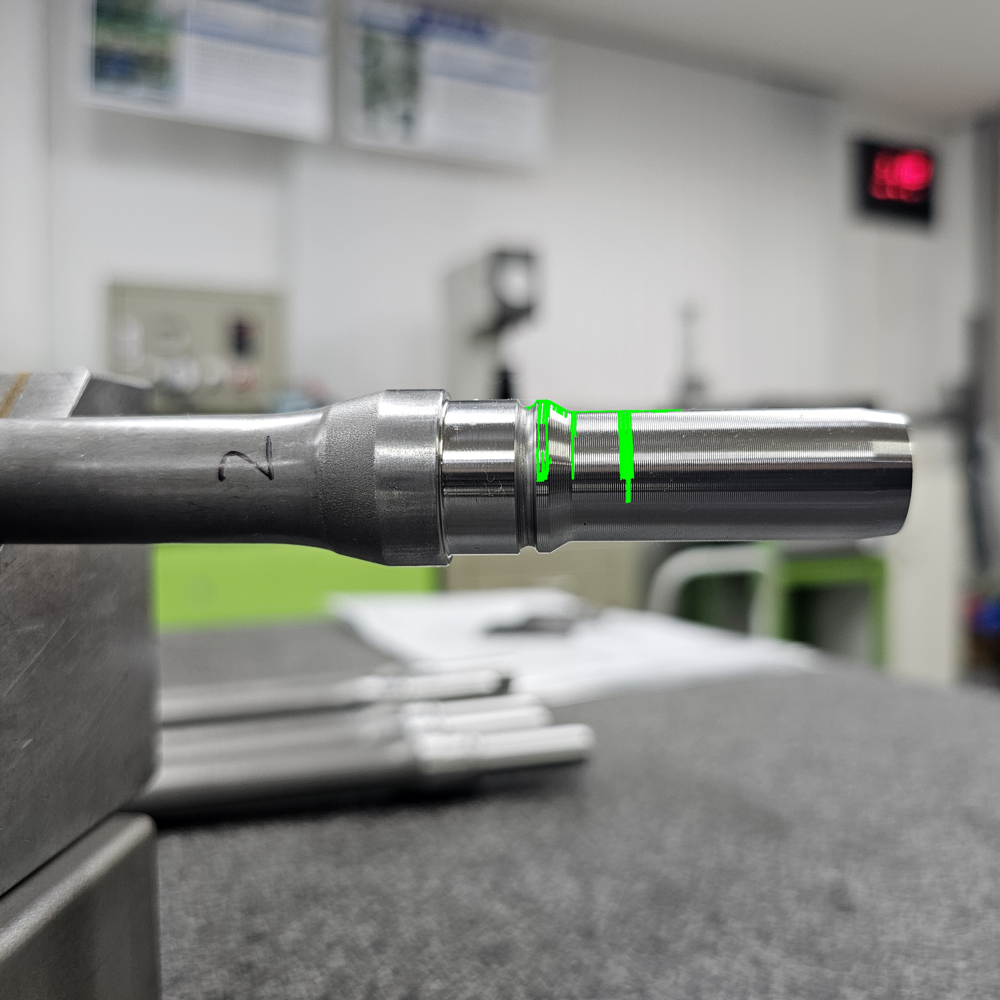

# Contour 기반 초기 외곽선 검출 실험

## 1. 실험 목적

샤프트 영상에서 OpenCV를 이용하여 제품 외곽선을
자동으로 검출할 수 있는지 확인하였다.

## 2. 처리 과정

1. 원본 이미지 입력
2. Gray 변환
3. Gaussian Blur 적용
4. Canny Edge 검출
5. Contour 검출
6. 면적이 가장 큰 Contour 선택
7. 선택된 Contour를 초록색으로 시각화

## 3. 결과

초록색 선은 Canny Edge에서 검출된 Contour 중
면적이 가장 큰 Contour를 나타낸다.

## 4. 확인된 한계

검출 결과가 샤프트의 실제 측정 외경 전체를
안정적으로 나타내지 못하고 일부 단차 및 표면 영역의
경계에 영향을 받는 현상을 확인하였다.

따라서 Contour 자체를 외경 측정값으로 사용하는 대신,
이후에는 측정 ROI를 설정하고 상단 및 하단 Edge를
직접 검출하여 두 Edge 사이의 거리를 측정하는 방식으로
측정 알고리즘을 발전시켰다.