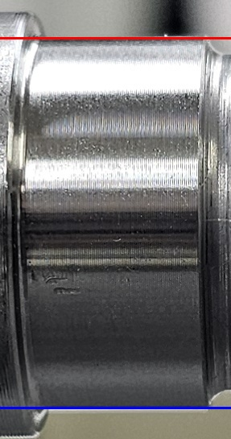

# Basic Edge 외경 측정

## 1. 실험 목적

샤프트 ROI 영상에서 상단 및 하단 Edge를 검출하고,
두 Edge 사이의 Pixel 거리를 이용하여 외경을 측정하는
기본 측정 방법을 구현하였다.

## 2. 처리 과정

1. ROI 이미지 입력
2. Gray 변환
3. Gaussian Blur 적용
4. Canny Edge 검출
5. ROI 중심을 기준으로 상단/하단 영역 분리
6. 상단 Edge 검출
7. 하단 Edge 검출
8. 두 Edge 사이의 Pixel 거리 계산

외경 Pixel 값은 다음과 같이 계산한다.

diameter_pixel = y_bottom - y_top

## 3. 결과 이미지

### 선의 의미

- 빨간색 가로선: 검출된 상단 Edge
- 파란색 가로선: 검출된 하단 Edge

두 Edge 사이의 세로 Pixel 거리를 샤프트 외경으로 계산하였다.

## 4. 실행 결과값

코드는 다음 값을 출력하도록 구성하였다.

- ROI 높이
- ROI 중심 y 좌표
- 상단 Edge y 좌표
- 하단 Edge y 좌표
- 샤프트 외경(pixel)

※ 실제 수치값은 실행 로그에서 확인된 값만 기록한다.

## 5. 한계

전체 ROI에서 하나의 상단 Edge와 하나의 하단 Edge를
대표 Edge로 선택하는 방식이므로 특정 위치의 반사광,
가공무늬 및 내부 Edge의 영향을 받을 가능성이 있다.

따라서 이후 단계에서는 여러 위치에서 외경을 측정하는
Multi-point 방식으로 측정 방법을 확장하였다.