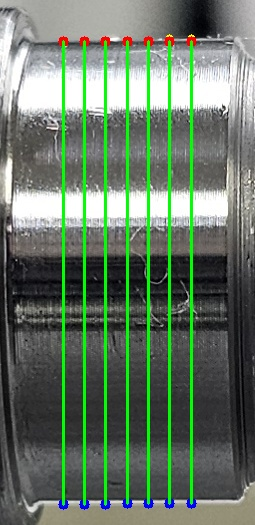

# Median 기반 Edge 안정화

## 1. 실험 목적

Multi-point 측정에서 위치별로 검출되는 상단 Edge의
불안정성을 줄이기 위해 중앙값(Median)을 이용하여
상단 Edge 위치를 안정화하였다.

## 2. 처리 과정

1. ROI 이미지 입력
2. Gray 변환
3. Gaussian Blur 적용
4. Canny Edge 검출
5. 중앙 영역에서 7개 측정 위치 선정
6. 각 위치의 상단 Edge 후보 검출
7. 상단 Edge 후보들의 중앙값 계산
8. 중앙값을 안정화된 상단 Edge로 적용
9. 각 위치의 하단 Edge와 외경 계산

상단 Edge 안정화는 다음과 같이 수행하였다.

stable_top = median(top_candidates)

## 3. 결과 이미지

### 표시 의미

- 노란색 점: 최초 검출된 상단 Edge 후보
- 빨간색 점: Median으로 안정화한 상단 Edge
- 파란색 점: 하단 Edge
- 초록색 선: 외경 측정 구간

## 4. 평가

상단 Edge 후보의 표준편차를 계산하고,
Median 적용 전과 적용 후의 Edge 안정성을 비교하였다.

또한 7개 위치에서 계산된 외경에 대해
평균, 중앙값 및 표준편차를 계산하였다.

## 5. Day016과 비교

Day016의 기준 대표값 459 pixel과
Day018의 대표 외경값을 비교하도록 구현하였다.

## 6. 의미

Multi-point 측정에서 위치별 Edge 검출 결과가 달라지는
문제를 줄이기 위해 대표 Edge를 중앙값으로 안정화한 단계이다.

이후 Sub-pixel 보간을 적용하여 Pixel 이하 수준의
정밀 Edge 위치 추정으로 발전시켰다.