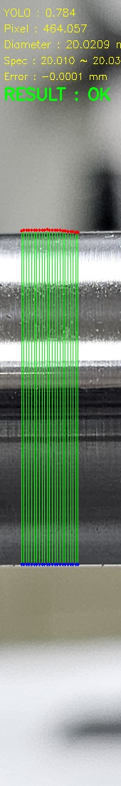

# Shaft OD Measurement End-to-End V1

## 1. 목적

본 단계에서는 앞선 개발 단계에서 검토한
YOLO ROI 탐지, OpenCV Edge 측정, 정밀 측정 및 Calibration을
하나의 파이프라인으로 연결하여
샤프트 외경 자동측정 End-to-End V1을 구현하였다.

전체 처리 흐름은 다음과 같다.

이미지 입력
→ YOLO ROI 탐지
→ OpenCV Edge 검출
→ Multi-point 측정
→ Edge 안정화
→ Sub-pixel 기반 정밀 측정
→ Pixel 외경 계산
→ Calibration
→ mm 외경 변환
→ 제품 규격 비교
→ OK / NG 판정

---

## 2. 입력 이미지

Day027에서는 `sample_07` 이미지를 이용하여
최종 End-to-End 동작을 실행하였다.

YOLO 모델을 이용하여 이미지에서
외경 측정 대상 ROI를 탐지한 후,
탐지된 ROI 내부에서 OpenCV 기반 정밀 측정을 수행하였다.

---

## 3. YOLO ROI 탐지

YOLO는 전체 이미지에서
외경을 측정할 대상 영역을 자동으로 탐지하는 역할을 수행한다.

Day027 실행 결과에서 확인된 YOLO confidence는 다음과 같다.

| 항목 | 결과 |
|---|---:|
| YOLO confidence | 0.784195 |

YOLO가 직접 외경(mm)을 측정하는 것은 아니다.

YOLO의 역할은 측정 대상 ROI를 찾는 것이며,
실제 외경 계산은 탐지된 ROI 내부에서
OpenCV 기반 영상처리를 통해 수행하였다.

---

## 4. OpenCV 정밀 외경 측정

YOLO로 탐지한 ROI 내부에서
여러 위치의 상단 및 하단 Edge를 검출하였다.

단일 위치의 Edge에만 의존하지 않고
여러 x 위치에서 외경을 측정하여
금속 표면의 반사광, 가공무늬 및 영상 노이즈에 의한
측정 변동을 줄이는 방향으로 구성하였다.

최종 V1에서는 앞선 개발 과정에서 검토한

- Edge 검출
- Multi-point 측정
- Edge 안정화
- 정밀 Edge 위치 계산

등을 하나의 측정 과정으로 연결하였다.

---

## 5. Pixel → mm Calibration

영상처리를 통해 계산된 외경은 Pixel 단위이므로
실제 외경(mm)으로 변환하기 위한 Calibration을 적용하였다.

Day027에서 사용한 Calibration 기준은 다음과 같다.

| 항목 | 값 |
|---|---:|
| Calibration Pixel | 464.0600 px |
| Calibration 기준값 | 20.0210 mm |

이 기준을 이용하여 영상에서 측정된 Pixel 외경을
mm 단위 외경으로 변환하였다.

---

## 6. End-to-End 실행 결과

Day027의 실제 실행 결과는 다음과 같다.

| 항목 | 결과 |
|---|---:|
| YOLO confidence | 0.784195 |
| Calibration Pixel | 464.0600 px |
| Calibration 기준값 | 20.0210 mm |
| 측정 Pixel | 464.0575 px |
| Vision 측정값 | 20.0209 mm |
| Pixel 표준편차 | 1.0460 px |
| 기준값과의 차이 | -0.0001 mm |
| 제품 규격 | 20.010 ~ 20.030 mm |
| 판정 | OK |

실행 결과 원본은 `measurement_result.txt`에 저장하였다.

---

## 7. 제품 규격 판정

도면 기준 외경은 다음과 같다.

- 기준 외경 : Ø20.020 mm
- 공차 : ±0.010 mm
- 허용범위 : 20.010 ~ 20.030 mm

Day027 Vision 측정값:

`20.0209 mm`

규격 비교:

`20.010 ≤ 20.0209 ≤ 20.030`

따라서 프로그램은 해당 샘플을

`RESULT : OK`

로 판정하였다.

---

## 8. 결과 이미지

최종 결과 이미지에는
End-to-End 측정 결과를 시각화하였다.

이미지의 주요 표시는 다음과 같다.

- 빨간 점 : 상단 Edge
- 파란 점 : 하단 Edge
- 초록선 : 상단과 하단 Edge 사이의 외경 측정 구간
- YOLO : ROI 탐지 confidence
- Pixel : 영상에서 계산된 외경
- Diameter : Calibration 후 외경(mm)
- Spec : 제품 허용 규격
- Error : Calibration 기준값과 Vision 측정값의 차이
- RESULT : 규격에 따른 OK / NG 판정

---

## 9. 구현된 End-to-End 기능

본 V1에서 구현한 기능은 다음과 같다.

이미지 입력
→ YOLO ROI 자동 탐지
→ ROI 추출
→ OpenCV 기반 Edge 탐색
→ 여러 위치에서 외경 측정
→ Pixel 외경 계산
→ Calibration 적용
→ mm 외경 계산
→ 제품 규격 비교
→ OK / NG 판정
→ 결과 이미지 및 텍스트 저장

따라서 개별 영상처리 실험을 넘어
이미지 입력부터 최종 판정까지 연결되는
End-to-End 측정 흐름을 구현하였다.

---

## 10. 결과 해석 시 주의사항

Day027 결과에서 Vision 측정값은 20.0209 mm,
Calibration 기준값은 20.0210 mm로
차이는 약 -0.0001 mm이다.

그러나 이 값을 시스템의 독립적인
측정 정확도 검증 결과로 해석해서는 안 된다.

Day027에서는 `sample_07`의 기준 실측값과
Calibration Pixel을 이용하여 변환 기준을 설정하였기 때문에,
해당 기준점 주변에서 Vision 측정값이 기준값과
매우 가깝게 나타나는 것은 Calibration 구조의 영향을 받는다.

따라서 이 결과로
시스템이 ±0.010 mm 수준의 측정 정확도를
확보했다고 판단할 수 없다.

---

## 11. 현재까지 검증된 것

본 단계에서 확인된 것은 다음과 같다.

- YOLO를 이용한 ROI 탐지 기능
- ROI 내부 OpenCV 기반 Edge 측정
- 여러 위치의 Pixel 외경 계산
- Pixel → mm Calibration
- mm 측정값과 제품 규격 비교
- OK / NG 자동 판정
- 결과 이미지 저장
- 측정 결과 텍스트 저장
- 위 기능이 하나의 코드 흐름으로 연결되어 실행됨

즉, 샤프트 외경 자동측정 시스템의
End-to-End V1 동작 구조를 구현하였다.

---

## 12. 아직 검증되지 않은 것

현재 결과만으로 다음 사항까지 검증되었다고 판단할 수 없다.

- 다양한 제품에서의 측정 정확도
- ±0.010 mm 측정 정확도의 독립적 입증
- 반복 측정 안정성
- 복수 기준물 기반 Calibration 정확도
- 카메라 위치 변화에 대한 강건성
- 조명 및 반사광 변화에 대한 강건성
- 실제 생산라인에서의 장기 안정성
- 실제 설비와의 실시간 연계 성능

따라서 본 결과는 양산 측정시스템의 최종 성능 검증이 아니라,
End-to-End V1의 기술적 구현 및 동작 확인 결과로 해석한다.

---

## 13. 결론

본 프로젝트에서는

YOLO ROI 탐지
→ OpenCV 기반 정밀 Edge 측정
→ Pixel 외경 계산
→ Calibration
→ mm 변환
→ 제품 규격 비교
→ OK / NG 판정

까지 연결되는 샤프트 외경 자동측정
End-to-End V1을 구현하였다.

Day027 실행에서는
20.0209 mm의 Vision 측정값이 계산되었으며,
설정된 제품 규격 20.010 ~ 20.030 mm와 비교하여
OK 판정이 출력되는 것을 확인하였다.

다만 Calibration 기준 샘플과 제한된 영상 데이터를 이용한
개발단계 결과이므로,
실제 생산환경 적용을 위해서는 복수 기준물,
독립 검증 데이터, 반복 측정 및 다양한 촬영조건을 이용한
추가 성능 검증이 필요하다.